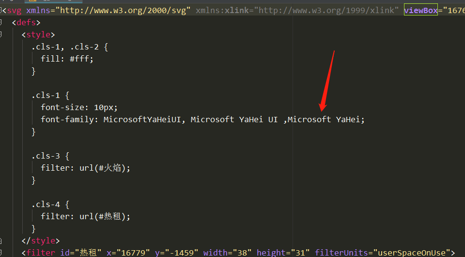

我的浏览器的效果测试的（应该是360浏览器）效果

热租和旁边的火焰是一张图片，但是效果不一样

#### 原因

图片是svg格式，浏览器解析了svg，热租文字的`font-family`不存在所以转成了默认字体

#### 解决

1. 把图片转成png或者jpg
2. 把图片拖到编辑器里（我用的是webstrom，不知道vscode可不可以）,把字体的改成相近的

|省事第二种，不过要遵循设计稿还是转一下格式一下比较好